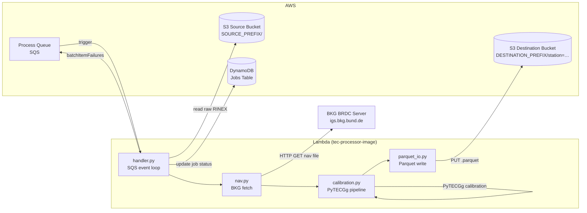
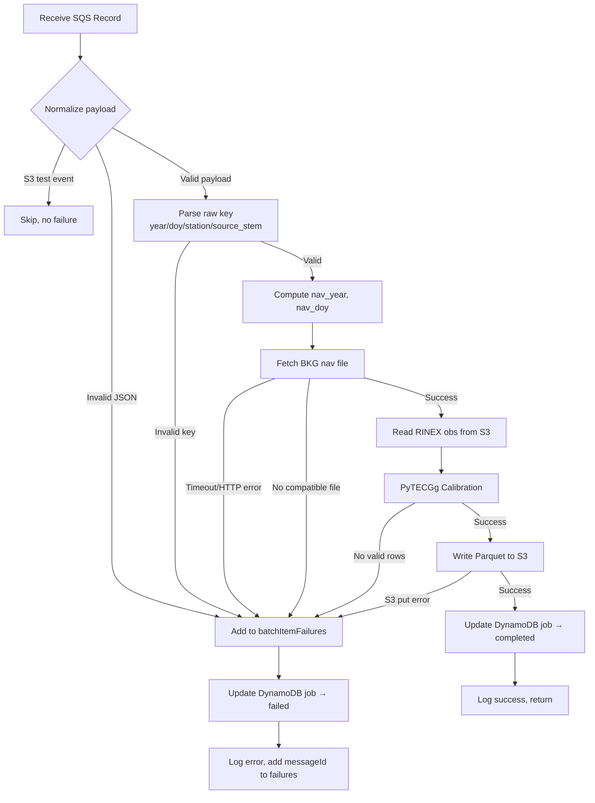
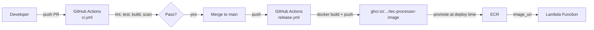

# Design Document: tec-processor-image

## Overview

This design describes the `tec-processor-image` — a standalone OCI container image repository that packages the TEC (Total Electron Content) processor as an AWS Lambda function. The image encapsulates the full calibration pipeline: reading raw RINEX observation data from S3, fetching BKG navigation files, running PyTECGg calibration, writing Parquet output back to S3, and updating DynamoDB job status.

The image exists because the processor's dependency stack (PyTECGg, polars, scipy, numba, numpy, pyarrow) exceeds Lambda's 250 MB zip/layer limit at ~881 MB unzipped. A container image (up to 10 GB) is the only viable packaging option.

### Key Design Decisions

1. **GHCR as build artifact registry** — Images are built and published to GitHub Container Registry by CI. Promotion to ECR for Lambda deployment is out of scope for this repository.
2. **Reusable CI workflows** — Build, test, scan, and publish logic lives in `actionsforge/actions`; this repository's workflow files contain orchestration only.
3. **Partial batch failure pattern** — The handler processes each SQS record independently, collecting failures into `batchItemFailures` rather than failing the entire invocation.
4. **Environment defaults with per-message overrides** — Processing parameters default from environment variables but can be overridden per-message for reprocessing jobs.
5. **No synthetic data** — Every code path producing output must invoke PyTECGg on real RINEX data. No demo rows, fallback coordinates, or hardcoded TEC values.

## Architecture



### Processing Flow (per SQS record)



### Deployment Flow



## Components and Interfaces

### Module Layout

```
tec-processor-image/
├── Dockerfile
├── .dockerignore
├── pyproject.toml
├── requirements.lock          # exact resolved versions
├── src/
│   └── processor/
│       ├── __init__.py
│       ├── handler.py         # Lambda entry point
│       ├── logic.py           # orchestration per record
│       ├── nav.py             # BKG nav fetch
│       ├── calibration.py     # PyTECGg wrapper
│       └── parquet_io.py      # Parquet encoding + S3 write
├── tests/
│   ├── conftest.py
│   ├── test_handler.py
│   ├── test_logic.py
│   ├── test_nav.py
│   ├── test_calibration.py
│   └── test_parquet_io.py
├── .github/
│   └── workflows/
│       ├── ci.yml
│       └── release.yml
├── README.md
├── LICENSE
├── .gitignore
└── .kiro/
```

### Component Interfaces

#### `handler.py` — Lambda Entry Point

```python
def handler(event: dict, context: Any) -> dict:
    """
    Lambda handler for SQS batch processing.
    
    Args:
        event: SQS event with Records array
        context: Lambda context (unused)
    
    Returns:
        {"batchItemFailures": [{"itemIdentifier": messageId}, ...]}
    
    Raises:
        RuntimeError: if split S3 config is not set (SOURCE_BUCKET/SOURCE_PREFIX/DESTINATION_BUCKET/DESTINATION_PREFIX)
    """
```

Responsibilities:
- Validate split S3 config is set (fail entire invocation if missing)
- Iterate `event["Records"]`, normalize each payload
- Delegate to `logic.process_record()` per record
- Collect `batchItemFailures` from exceptions
- Return partial batch failure response

#### `logic.py` — Per-Record Orchestration

```python
def process_record(
    payload: dict,
    source_bucket: str,
    source_prefix: str,
    destination_bucket: str,
    destination_prefix: str,
    env_params: dict,
) -> str:
    """
    Process a single normalized SQS record payload.
    
    Args:
        payload: Normalized dict with key, bucket, job_id, trace_id, parameters
        source_bucket: S3 source bucket
        source_prefix: Required input key prefix
        destination_bucket: S3 destination bucket
        destination_prefix: Output key prefix root
        env_params: Environment-derived defaults for processing parameters
    
    Returns:
        output_key: S3 key of written Parquet file
    
    Raises:
        ProcessingError: on any failure (nav fetch, calibration, S3 write)
    """
```

Responsibilities:
- Parse raw key → year, doy, station, source_stem
- Merge message parameters over environment defaults
- Validate merged parameters
- Orchestrate: nav fetch → calibration → parquet write
- DynamoDB job status updates (processing → completed/failed)
- Structured logging

#### `nav.py` — BKG Navigation Fetch

```python
def fetch_nav_file(
    year: int,
    doy: int,
    nav_day_offset: int = 1,
    timeout_list: float = 30.0,
    timeout_download: float = 120.0,
) -> Path:
    """
    Fetch BKG BRDC navigation file for given observation date.
    
    Args:
        year: Observation year
        doy: Observation day of year (1-366)
        nav_day_offset: Days before observation DOY to fetch nav data
        timeout_list: HTTP timeout for directory listing
        timeout_download: HTTP timeout for file download
    
    Returns:
        Path to downloaded navigation file in /tmp
    
    Raises:
        NavFetchError: on HTTP error, timeout, or no compatible file
    """

def compute_nav_doy(year: int, doy: int, offset: int) -> tuple[int, int]:
    """
    Compute navigation (year, doy) from observation date and offset.
    Rolls back to previous year when result < 1.
    """
```

#### `calibration.py` — PyTECGg Wrapper

```python
def calibrate(obs_path: Path, nav_path: Path) -> pd.DataFrame | None:
    """
    Run PyTECGg calibration pipeline on RINEX observation + navigation files.
    
    Returns:
        DataFrame with columns [epoch, sv, id_arc, lat_ipp, lon_ipp,
        azi, ele, bias, stec, vtec, veq] or None if no valid rows.
    
    Raises:
        CalibrationError: if PyTECGg is not importable or calibration crashes
    """
```

#### `parquet_io.py` — Parquet Encoding + S3 Write

```python
OUTPUT_COLUMNS = [
    "epoch", "sv", "id_arc", "lat_ipp", "lon_ipp",
    "azi", "ele", "bias", "stec", "vtec", "veq",
]

def write_parquet(
    df: pd.DataFrame,
    bucket: str,
    station: str,
    year: int,
    doy: int,
    source_stem: str,
) -> str:
    """
    Write DataFrame as Snappy-compressed Parquet to S3.
    
    Returns:
        The S3 key written: {DESTINATION_PREFIX}/station={station}/year={year}/doy={doy:03d}/{source_stem}.parquet
    
    Raises:
        OutputError: on S3 put failure or schema mismatch
    """

def build_output_key(station: str, year: int, doy: int, source_stem: str) -> str:
    """Deterministic output key construction."""
```

### Dockerfile Design

```dockerfile
FROM python:3.13-slim

# Install application package from repository root pyproject.toml
COPY pyproject.toml requirements.lock ./
RUN pip install --no-cache-dir -r requirements.lock

COPY src/ ${LAMBDA_TASK_ROOT}/

CMD ["processor.handler.handler"]
```

Design rationale:
- **Pinned base image tag**: `python:3.13` (specific patch tag in practice, e.g., `3.13.2.2025.01.14.10`) ensures reproducibility
- **Two-stage COPY**: Copy dependency files first for Docker layer caching; application source changes don't invalidate the pip install layer
- **Lock file install**: `requirements.lock` ensures byte-for-byte reproducible installs
- **No secrets**: No `ENV` directives with credentials; runtime credentials come from Lambda execution role
- **No USER change**: AWS Lambda base image runs as non-root (`sbx_user1051`); we preserve that

### Versioning and Tagging Strategy

| Trigger | Image Tags | Example |
|---------|-----------|---------|
| Push to `main` | `<sha>`, `latest` | `abc123def…`, `latest` |
| Semver tag `v1.2.3` | `1.2.3` | `1.2.3` |
| Semver pre-release `v1.2.3-rc.1` | `1.2.3-rc.1` | `1.2.3-rc.1` |

- Semver tags are **immutable** — once pushed, a tag like `1.2.3` is never overwritten
- `latest` always points to the most recent `main` branch build
- The monorepo pins the image via `processor_image_uri` Terraform variable using a specific SHA or semver tag (never `latest` in production)

### Monorepo Integration

The monorepo `event-driven-serverless-platform-demo` references this image in its processing Terraform module:

```hcl
variable "processor_image_uri" {
  description = "ECR URI for the TEC processor Lambda image"
  type        = string
  # Example: 123456789012.dkr.ecr.us-east-1.amazonaws.com/tec-processor-image:1.2.3
}

resource "aws_lambda_function" "processor" {
  function_name = "tec-processor"
  package_type  = "Image"
  image_uri     = var.processor_image_uri
  # ...
}
```

To deploy a new image version:
1. Merge to `main` or push semver tag → GHCR image is published
2. Promote GHCR → ECR (manual `docker pull/tag/push` or deploy script)
3. Update `processor_image_uri` in monorepo Terraform and apply

## Data Models

### SQS Message Payloads

The handler normalizes three message formats into a common internal payload:

#### Direct Processor Message
```json
{
  "key": "SOURCE_PREFIX/2024/150/auck1500.24o",
  "bucket": "my-data-lake",
  "job_id": "job-abc-123",
  "trace_id": "550e8400-e29b-41d4-a716-446655440000",
  "parameters": {
    "NAV_DAY_OFFSET": 2,
    "SAVE_PARQUET": true
  }
}
```

#### S3 Event Notification (via SQS)
```json
{
  "Records": [{
    "eventSource": "aws:s3",
    "s3": {
      "bucket": {"name": "my-data-lake"},
      "object": {"key": "SOURCE_PREFIX/2024/150/auck1500.24o"}
    }
  }]
}
```

#### SNS-wrapped S3 Event
```json
{
  "Message": "{\"Records\":[{\"eventSource\":\"aws:s3\",\"s3\":{...}}]}"
}
```

#### S3 Test Event (skipped)
```json
{
  "Event": "s3:TestEvent",
  "Service": "Amazon S3",
  "Time": "2024-01-01T00:00:00Z",
  "Bucket": "my-data-lake"
}
```

### Normalized Internal Payload

```python
@dataclass
class ProcessorPayload:
    key: str              # S3 object key for raw RINEX
    bucket: str           # S3 bucket name
    job_id: str | None    # Optional reprocessing job ID
    trace_id: str         # UUID v4 (provided or generated)
    parameters: dict      # Merged processing parameters
```

### Raw Key Structure

```
{SOURCE_PREFIX}/{year}/{doy}/{filename}
                  │      │      │
                  │      │      └─ e.g., "auck1500.24o"
                  │      └─ 3-digit DOY (001–366)
                  └─ 4-digit year
```

Parsed fields:
- `year`: int (4-digit)
- `doy`: int (1–366)
- `station`: str (first 4 alphabetic chars of filename, lowercased)
- `source_stem`: str (filename without final extension, e.g., `auck1500`)

### Parquet Output Schema

| Column | Type | Description |
|--------|------|-------------|
| `epoch` | `timestamp[us, tz=UTC]` | Observation epoch |
| `sv` | `string` | Satellite vehicle ID (e.g., "G01") |
| `id_arc` | `int64` | Arc identifier |
| `lat_ipp` | `float64` | IPP latitude (degrees) |
| `lon_ipp` | `float64` | IPP longitude (degrees) |
| `azi` | `float64` | Azimuth (degrees) |
| `ele` | `float64` | Elevation (degrees) |
| `bias` | `float64` | Receiver bias estimate (TECU) |
| `stec` | `float64` | Slant TEC (TECU) |
| `vtec` | `float64` | Vertical TEC (TECU) |
| `veq` | `float64` | Vertical equivalent (TECU) |

Output path: `{DESTINATION_PREFIX}/station={station}/year={year}/doy={doy:03d}/{source_stem}.parquet`

### DynamoDB Job Record

| Field | Type | Description |
|-------|------|-------------|
| `job_id` | `S` (PK) | Reprocessing job identifier |
| `status` | `S` | `queued` → `processing` → `completed` \| `failed` |
| `output_key` | `S` | S3 key of output (on success) |
| `error_type` | `S` | Exception class name (on failure) |
| `error_message` | `S` | Error description (on failure) |
| `updated_at` | `S` | ISO 8601 timestamp of last update |

### Processing Parameters

| Parameter | Type | Default | Source |
|-----------|------|---------|--------|
| `NAV_DAY_OFFSET` | `int > 0` | `1` | Env / message override |
| `SAVE_PARQUET` | `bool` | `true` | Env / message override |
| `SAVE_CSV` | `bool` | `false` | Env (forward compat, rejected if enabled) |
| `SAVE_STATIC_PLOTS` | `bool` | `false` | Env (forward compat, rejected if enabled) |
| `SAVE_INTERACTIVE_PLOTS` | `bool` | `false` | Env (forward compat, rejected if enabled) |

### Structured Log Entry Schema

```json
{
  "trace_id": "uuid-v4",
  "message_id": "sqs-message-id",
  "station": "auck",
  "year": 2024,
  "doy": 150,
  "outcome": "success | error | skipped",
  "duration_ms": 12345,
  "row_count": 8640,
  "output_key": "DESTINATION_PREFIX/station=auck/year=2024/doy=150/auck1500.parquet",
  "error_type": "CalibrationError",
  "error_message": "No valid TEC rows",
  "stack_trace": "Traceback (most recent call last):\n...",
  "reason": "s3_test_event"
}
```


## Correctness Properties

*A property is a characteristic or behavior that should hold true across all valid executions of a system — essentially, a formal statement about what the system should do. Properties serve as the bridge between human-readable specifications and machine-verifiable correctness guarantees.*

### Property 1: Partial Batch Failure Completeness

*For any* SQS event with N records where K records succeed (or are skipped as S3 test events) and N-K records fail processing, the handler response SHALL contain a `batchItemFailures` array with exactly N-K entries, each containing the `messageId` of a failed record, and no successful record's `messageId` SHALL appear in that array.

**Validates: Requirements 3.1, 3.7, 3.8, 3.9**

### Property 2: Payload Normalization

*For any* valid SQS record body in a supported format (direct processor message, S3 event notification, or SNS-wrapped S3 event), the normalization function SHALL extract the same S3 bucket and key values regardless of which envelope format wraps them, and SHALL propagate all optional fields (job_id, trace_id, bucket, parameters) present in the original message.

**Validates: Requirements 3.2, 3.3, 3.4, 3.6**

### Property 3: Invalid Payload Rejection

*For any* SQS record body that contains invalid JSON, cannot be normalized to a payload with a `key` field (and is not an S3 test event), or specifies a `bucket` that does not match `SOURCE_BUCKET`, the handler SHALL include that record's `messageId` in `batchItemFailures`.

**Validates: Requirements 3.10, 3.11**

### Property 4: Raw Key Parse Determinism

*For any* valid raw key matching `{SOURCE_PREFIX}/{year}/{doy}/{filename}`, parsing SHALL always produce the same `(year, doy, station, source_stem)` tuple, where `station` is the first four alphabetic characters lowercased and `source_stem` is the filename without its final dot-separated extension. For any key not matching this pattern (or with invalid doy/station), parsing SHALL raise an error.

**Validates: Requirements 4.1, 4.2**

### Property 5: Nav DOY Computation with Year Rollback

*For any* valid observation `(year, doy)` pair and positive integer `nav_day_offset`, the computed `(nav_year, nav_doy)` SHALL equal `(year, doy - offset)` when `doy - offset >= 1`, and SHALL roll back to `(year - 1, days_in_year(year-1) - (offset - doy))` when `doy - offset < 1`. The result SHALL always satisfy `1 <= nav_doy <= 366`.

**Validates: Requirements 4.3**

### Property 6: Invalid Parameter Rejection

*For any* processing parameter set containing a `NAV_DAY_OFFSET` that is non-integer or ≤ 0, a non-boolean save flag, or an unsupported parameter key, the handler SHALL treat the record as a processing failure.

**Validates: Requirements 4.8, 7.3**

### Property 7: Calibration Row Filtering

*For any* DataFrame produced by PyTECGg calibration, the filtered output SHALL contain only rows where `id_arc_valid`, `stec`, and `vtec` are all non-null, and the `id_arc` column SHALL contain integer values mapped from `id_arc_valid`.

**Validates: Requirements 5.2**

### Property 8: No Output Without Calibration

*For any* record where PyTECGg calibration was not successfully invoked or produced no valid rows, no file SHALL be written under `DESTINATION_PREFIX` for that record.

**Validates: Requirements 5.3, 9.2**

### Property 9: Output Path Determinism

*For any* valid `(station, year, doy, source_stem)` tuple and fixed destination prefix, the output S3 key SHALL always equal `{DESTINATION_PREFIX}/station={station}/year={year}/doy={doy:03d}/{source_stem}.parquet`, where `source_stem` is the input filename with its final dot-separated extension removed.

**Validates: Requirements 6.1, 6.3**

### Property 10: Parquet Schema Invariance

*For any* Parquet file written by the handler, it SHALL contain exactly 11 columns: `epoch`, `sv`, `id_arc`, `lat_ipp`, `lon_ipp`, `azi`, `ele`, `bias`, `stec`, `vtec`, `veq` — no more, no fewer.

**Validates: Requirements 6.2**

### Property 11: Parquet Binary Validity

*For any* Parquet file written by the handler, the file SHALL begin with the magic bytes `PAR1`, use Snappy compression, and be readable by pyarrow without raising exceptions.

**Validates: Requirements 6.7, 9.1**

### Property 12: Parameter Override Precedence

*For any* allowed parameter key present in both environment defaults and the message `parameters` object, the resolved value SHALL equal the message-provided value. For any allowed parameter key absent from the message `parameters`, the resolved value SHALL equal the environment default.

**Validates: Requirements 7.1, 7.2**

### Property 13: Structured JSON Log Format

*For any* log entry emitted by the handler to stdout, the entry SHALL be valid single-line JSON parseable by `json.loads()`.

**Validates: Requirements 13.1**

### Property 14: Log Entry Completeness

*For any* successfully processed record, the log entry SHALL contain `outcome="success"`, `trace_id`, `station`, `year`, `doy`, `duration_ms`, `row_count`, `output_key`, and `message_id`. *For any* failed record, the log entry SHALL contain `outcome="error"`, `error_type`, `error_message`, `stack_trace`, `duration_ms`, and `message_id`.

**Validates: Requirements 13.2, 13.3, 13.4**

### Property 15: Trace ID Invariance

*For any* single SQS record processed by the handler, all log entries emitted for that record SHALL share the same `trace_id` value. If the incoming message provides a `trace_id`, that exact value SHALL be used. If no `trace_id` is provided, a valid UUID v4 string SHALL be generated and used consistently across all log entries for that record.

**Validates: Requirements 13.5, 13.6**

## Error Handling

### Fail-Fast Errors (Entire Invocation)

| Condition | Behavior | Rationale |
|-----------|----------|-----------|
| Missing split S3 env (`SOURCE_BUCKET`, `SOURCE_PREFIX`, `DESTINATION_BUCKET`, `DESTINATION_PREFIX`) | Raise `RuntimeError` at handler entry | No records can succeed without source+destination contract |

### Per-Record Failures (Partial Batch)

| Error Category | Trigger | Recovery |
|----------------|---------|----------|
| **Payload normalization** | Invalid JSON, unsupported format, bucket mismatch | Record added to `batchItemFailures`; SQS retries |
| **Key parsing** | Invalid raw key pattern, bad DOY, non-alpha station | Record added to `batchItemFailures` |
| **Parameter validation** | Non-integer NAV_DAY_OFFSET, non-positive offset, unsupported key | Record added to `batchItemFailures` |
| **Nav fetch** | HTTP error, timeout (30s listing / 120s download), no compatible file | Record added to `batchItemFailures`; SQS retries (transient) |
| **Calibration** | PyTECGg import failure, empty observations, no valid TEC rows | Record added to `batchItemFailures`; no output written |
| **S3 write** | put_object failure | Record added to `batchItemFailures`; SQS retries |
| **DynamoDB update** | DynamoDB error | Log warning only; record NOT failed (isolated) |

### Error Isolation Principle

- Each SQS record is processed independently
- One record's failure does not affect other records in the batch
- DynamoDB update failures are non-fatal (warn and continue)
- S3 test events are skipped silently (no failure, no output)

### Retry Behavior

The handler relies on SQS visibility timeout and redrive policy for retries:
- Records in `batchItemFailures` remain on the queue for retry
- Transient errors (network timeouts, S3 throttling) resolve on retry
- Permanent errors (invalid key, no nav file for date) retry up to max receive count then DLQ
- Idempotent output (PUT overwrites existing key) makes retries safe

### Exception Hierarchy

```python
class ProcessingError(Exception):
    """Base for all per-record processing failures."""

class PayloadError(ProcessingError):
    """Invalid or un-normalizable SQS record body."""

class KeyParseError(ProcessingError):
    """Raw key does not match expected pattern."""

class NavFetchError(ProcessingError):
    """BKG navigation file fetch failed."""

class CalibrationError(ProcessingError):
    """PyTECGg calibration failed or produced no valid rows."""

class OutputError(ProcessingError):
    """S3 Parquet write failed."""

class ParameterError(ProcessingError):
    """Invalid processing parameter value."""
```

## Testing Strategy

### Dual Testing Approach

The test suite uses both unit/example-based tests and property-based tests for comprehensive coverage:

- **Property-based tests** (Hypothesis): Verify universal properties that hold for all valid inputs — key parsing, payload normalization, parameter merging, output key construction, batch failure isolation
- **Unit tests** (pytest): Verify specific examples, integration points, error conditions, and DynamoDB/S3 interactions with mocks

### Property-Based Testing Configuration

- **Library**: [Hypothesis](https://hypothesis.readthedocs.io/) for Python
- **Minimum iterations**: 100 per property test (Hypothesis default settings with `max_examples=100`)
- **Tag format**: Each property test includes a comment: `# Feature: tec-processor-image, Property {N}: {title}`

### Test Categories

| Category | Framework | Scope |
|----------|-----------|-------|
| Raw key parsing | Hypothesis | Property 4: generate valid/invalid keys |
| Nav DOY computation | Hypothesis | Property 5: generate (year, doy, offset) triples |
| Payload normalization | Hypothesis | Property 2: generate all three message formats |
| Output key derivation | Hypothesis | Property 9: generate station/year/doy/stem |
| Parameter merging | Hypothesis | Property 12: generate env + message param combinations |
| Batch failure isolation | Hypothesis | Property 1: generate batches with mixed success/failure |
| Parquet schema | Hypothesis | Property 10: generate DataFrames, verify schema |
| Log format | Hypothesis | Property 13: generate log data, verify JSON validity |
| Row filtering | Hypothesis | Property 7: generate DataFrames with null patterns |
| Invalid params | Hypothesis | Property 6: generate invalid parameter values |
| BKG nav file selection | pytest | Integration: mock HTTP, verify URL/filename logic |
| DynamoDB lifecycle | pytest | Integration: mock DDB, verify status transitions |
| S3 interactions | pytest | Integration: mock S3, verify read/write calls |
| Calibration pipeline | pytest | Integration: mock PyTECGg, verify invocation |
| Handler end-to-end | pytest | Integration: full handler with all mocks |

### Test Isolation

All tests run without:
- AWS credentials (mocked via `unittest.mock` or `moto`)
- Network access to BKG (mocked HTTP responses)
- Live PyTECGg installation (calibration module mocked in handler tests; calibration unit tests mock PyTECGg internals)

### CI Integration

Tests run via the `actionsforge/actions/.github/workflows/python-image-pr-checks.yml` reusable workflow on every PR, using Python 3.13 and the dev dependency group from `pyproject.toml`.

### Dev Dependencies

```toml
[project.optional-dependencies]
dev = [
    "pytest >= 8.0",
    "hypothesis >= 6.100",
    "ruff >= 0.5",
    "moto[s3,dynamodb] >= 5.0",
]
```
